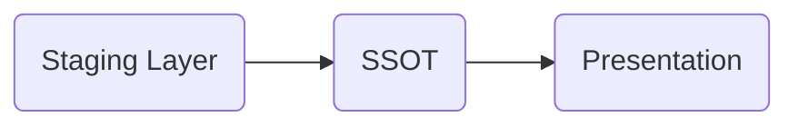

## Raw Data
The raw data has been downloaded from the shared files online into the data folder.
This is with the assumption that authentication against google drive is not necessary. I would expect the datasets would be in S3 and can be read through python in databricks or other interface.
## Data Exploration
The python notebooks were used for data exploration. This is to ensure that data can be read as expected using standard libraries.
The exploration identifies:
- Data inconsistencies that should be cleared. E.g Some customers are missing customer groups. In this case one can decide to fix the null values or ignore the column when performing analytics. There is also a customer_group_id 10 in customer table but that id doesnt exist as a primary key in customer-group table
- Understanding data ingestion, some datasets are in json file and other in csv files, this influences how the data is read.
## Extract
In ELT folder an extract file is added to extract data from the various sources including the csvs and json file
## Load
The data is then loaded into an sqlite database. Choosing Sqlite database was done because this is a development environment. It is also a quick solution to demostrate skills in handling structured data. In a production environment I would consider using a datawarehouse e.g. Bigquery or Snowflake. I would also bulk load the data using csv dump and/or json dump to save on memory space to process data, bulk load would also minimise the amount of inserts into the database, saving on cost.
## Transform
This project used DBT to transform the data.
Set Up DBT
- Install dbt python packages if not already installed from the requirements file
    `pip install dbt-core dbt-sqlite`
- Set up the profiles.yml page. Unless configured otherwise, the file is located in .dbt folder
    `nano  ~/.dbt/profiles.yml`
    `change main: to point to the right database`
    `change schema: to point to the folder containing project.yml file` in this case `air_boltic/elt/air_boltic_dbt\`
- Run dbt commands
    - Ensure configuration are well set `dbt debug`
    - Run the project `dbt run`

### DBT layers of transformation

#### Staging Layer
The staging layer presents data as it is in the raw form. It is materialised as view because the actual table data is needed when dbt jobs starts running. 
#### Single source of truth Layer (ssot)
Single source of truth layer presents entities as defined by the business. E.g the orders SSOT is presented as what business team count as an order. Only basic joins and aggregations are allowed here. This data is presented in the data platform to be reused in different analytics.
#### Analytics Layer (mart)
This presents data that has been aggregated, joined, with complex calculations to provide complex analysis in a simplified form. At this level users get aggregated data in the simplest form that business expect, e.g. what are the daily orders. or what were the daily trips. From this data set users can use simple queries to tell, how many trips/orders were placed in a day, a week or a month.

### Code Formatting
###### sqlfluff
This project uses sqlfluff. As a formatter and linter sqlfluff ensures a similar standard of code is maintained by contributers.
- `pip install sqlfluff`
- `sqlfluff lint --dialect sqlite .`
- `sqlfluff fix --dialect sqlite .`

###### black
Formatter for python file
- `pip install black`
- `black extract.py`

### CICD Setup
#### Environments
To effectively build and deploy changes on Github project, different environments are needed as follows.
###### Development Environment
Development environment is used by individual contributors to develop and test their changes. This includes access to raw data and assets for models development. If BigQuery is being used as a data warehouse a project, air-boltic-dev, can be used. Contributors will set up profile.yml pointing to this project with a prefix to uniquely identify dataset created by running dbt run on individual development environment.
After developmennt and testing changes the contributor pushes the changes to Github and opens a PR. This triggers a new environment, CI environment.
###### CI Environment
The CI environment ensures the changes made in the repository are correct and they conform to standards put in place by the team. In this environment, static code is analyzed for format, dbt run and test is done to ensure it doesn't break.
In BigQuery a separate project, air-boltic-ci can be used. The datasets created should be prefixed with pr number to uniquely identify assets produced by a specific pr. This environment is shared and can grow very fast, so datasets should be set to expire based on time or when the PR is closed or merged to main.
###### Example github actions steps
- Check code formatting
- Run dbt run on changed models
    - use production manifest.json to defer from
    - generated models(tables and datasets) go into a cicd database where they are deleted when PR is merged or after a period of time.
    The expiration of cicd assets keeps the cicd environment clean
- Run dbt test
If the changes are reviewed and passes the set CICD checks, they are then added to production environment
###### Production Environment
This environment produces models that are used by data analysts to develop business critical analysis. Developers aim to keep this environment available and correct.
DBT jobs on this environment are submitted to an orchestrator.
The manifest.json and run_results.json is stored for future reference.
Jobs include:
Checkout code repo(mostly `git clone` of dbt project main branch) >> `dbt deps` >> `dbt run` >> `dbt test` 

### Handling dbt artifacts in Production
After a run dbt produces important files e.g. manifest.json and run_results.json.
- manifest.json
    This file contains models, tests and macros lineage
- run_results.json
    This file contain metadata on every run.
Break down the results using [Elementary Data](https://www.elementary-data.com/) and store it for analysis of the health of the dbt environment

