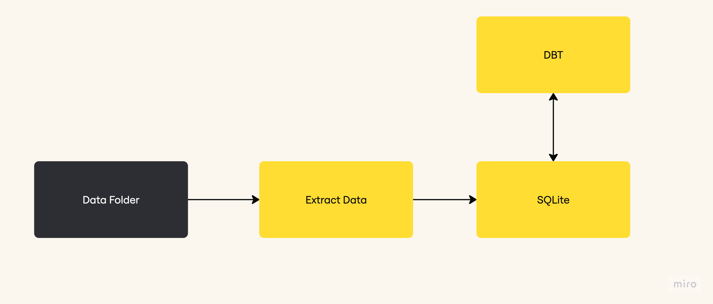

## Raw Data
For development purposes, the raw data has been downloaded from shared online files and placed in the data folder. This setup assumes that the data is stored in an S3 bucket, eliminating the need for Google Drive authentication. In a production environment, the datasets would typically reside in S3 and be accessed using Python through platforms like Databricks. Maintaining the data in its raw format is a best practice, as it allows for easy reconstruction of analytics datasets in the event of a data warehouse migration or data loss.
## Data Exploration
Python notebooks were used to perform initial data exploration, ensuring that the datasets could be read correctly using standard Python libraries. This step surfaced several important observations:

- Data inconsistencies:
    For example, some customer records are missing associated customer group values. Depending on the analysis requirements, these null values can either be imputed or the column can be excluded altogether. Additionally, a mismatch was identified where customer_group_id = 10 exists in the customer table, but is not present as a primary key in the customer_group table — indicating a referential integrity issue.

- Data format variability:
    The datasets are provided in both JSON and CSV formats, which affects how they are ingested and parsed during processing. Understanding these format differences is essential for consistent data handling.
## Extract
An extract script, located in the ELT folder, is used to pull data from various sources, including both CSV and JSON files. After extraction, the data is loaded into an SQLite database to enable easy querying and transformation during development.
## Load
SQLite was chosen as the database solution for this project due to its simplicity and suitability for a development environment. It provides a lightweight and efficient way to demonstrate the ability to work with structured data. However, in a production setting, a more robust data warehouse such as BigQuery or Snowflake would be preferable. Additionally, data would be bulk-loaded using CSV or JSON dumps to optimize memory usage and processing time. Bulk loading also reduces the number of individual insert operations, resulting in improved performance and lower operational costs.
## Transform
This project uses DBT (Data Build Tool) to manage data transformations in a modular, scalable, and version-controlled manner.
#### DBT Setup Steps
- Install Required Packages
    If not already installed, use the following command to install the necessary DBT packages:
    `pip install dbt-core dbt-sqlite`
- Configure the DBT Profile
    DBT requires a profiles.yml file to manage connection settings. This file is typically located at ~/.dbt/profiles.yml. To configure:
    - Open the file:
        `nano  ~/.dbt/profiles.yml`
    - Update the main: section to point to the correct SQLite database.
    - Set the schema: to the folder containing your project.yml file.
        `air_boltic/elt/air_boltic_dbt\`
- Run DBT Commands
    - Ensure configuration are well set 
        `dbt debug`
    - Run the project 
        `dbt run`

### DBT layers of transformation

#### Staging Layer
The staging layer serves as a representation of raw data in its original form. It is materialised as a view to ensure the underlying table data remains accessible when dbt jobs are initiated. This approach supports efficient processing and maintains the integrity of the pipeline's workflow.
#### Single source of truth Layer (ssot)
The Single Source of Truth (SSOT) layer represents entities as defined by the business, ensuring consistency and alignment with organisational standards. For example, the "orders" SSOT reflects what the business team recognises and considers as an order.

This layer is limited to basic joins and aggregations, focusing on preserving accuracy and simplicity. The processed data is then made available on the data platform for reuse across various analytical use cases, enabling consistency and efficiency in data-driven decision-making.
#### Analytics Layer (mart)
The Analytics Layer, often referred to as the Mart layer, delivers data that has been fully aggregated, joined, and enriched with complex calculations to support advanced analysis in a simplified and accessible format. This layer is tailored to meet business expectations by providing intuitive and aggregated insights, such as daily orders or daily trips.

At this level, users can easily perform simple queries to derive meaningful insights. For instance, they can determine how many trips or orders occurred in a day, week, or month. The Analytics Layer is designed to empower users with a highly usable dataset, streamlining query complexity and enabling efficient decision-making.

## Transformation Considerations
DBT is a great tool. It has a great community and makes working with SQL transformations efficient. However it also comes with its own shortcommings e.g. 
- DBT executes in the data warehouse which makes it impossible to carry out any tasks unless connected to the warehouse. 
- Excutions in the data warehouse can be very expensive especially as an organisation and its data grows.
- DBT is limited to batch processing making it impossible to get immediate data updates.
- Incremental data processing in DBT are complex as it requires jobs to be set for full refresh on a regular basis.

### Code Formatting
###### sqlfluff
This project uses sqlfluff. As a formatter and linter sqlfluff ensures a similar standard of code is maintained by contributers.
- `pip install sqlfluff`
- `sqlfluff lint --dialect sqlite .`
- `sqlfluff fix --dialect sqlite .`

###### black
Formatter for python file
- `pip install black`
- `black extract.py`

### CICD Setup
#### Environments
To effectively build and deploy changes on Github project, different environments are needed as follows.
###### Development Environment
Development environment is used by individual contributors to develop and test their changes. This includes access to raw data and assets for models development. If BigQuery is being used as a data warehouse a project, air-boltic-dev, can be used. Contributors will set up profile.yml pointing to this project with a prefix to uniquely identify dataset created by running dbt run on individual development environment.
After developmennt and testing changes the contributor pushes the changes to Github and opens a PR. This triggers a new environment, CI environment.
###### CI Environment
The CI environment ensures the changes made in the repository are correct and they conform to standards put in place by the team. In this environment, static code is analyzed for format, dbt run and test is done to ensure it doesn't break.
In BigQuery a separate project, air-boltic-ci can be used. The datasets created should be prefixed with pr number to uniquely identify assets produced by a specific pr. This environment is shared and can grow very fast, so datasets should be set to expire based on time or when the PR is closed or merged to main.
###### Example github actions steps
- Check code formatting
- Run dbt run on changed models
    - use production manifest.json to defer from
    - generated models(tables and datasets) go into a cicd database where they are deleted when PR is merged or after a period of time.
    The expiration of cicd assets keeps the cicd environment clean
- Run dbt test
If the changes are reviewed and passes the set CICD checks, they are then added to production environment
###### Production Environment
This environment produces models that are used by data analysts to develop business critical analysis. Developers aim to keep this environment available and correct.
DBT jobs on this environment are submitted to an orchestrator.
The manifest.json and run_results.json is stored for future reference.
Jobs include:

###### Incremental processing job
The submitted wokflow didn't cover incremental processing, however it is one of the powerful way of updating data in DBT. The normal production job can be used on models that materialise in an incremental model. A separate job will be needed for fully refreshing the incremental models.

### Handling dbt artifacts in Production
After a run dbt produces important files e.g. manifest.json and run_results.json.
- manifest.json
    This file contains models, tests and macros lineage
- run_results.json
    This file contain metadata on every run.
Break down the results using [Elementary Data](https://www.elementary-data.com/) and store it for analysis of the health of the dbt environment

## Current Architecture

## Ideal Architecture

